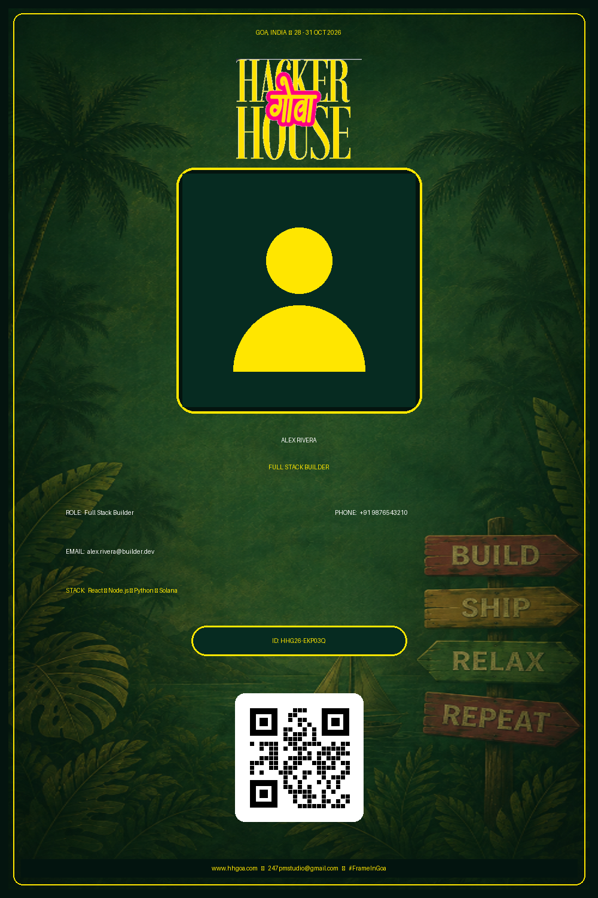

# HHGoa2026
# 🌴 Hacker House Goa 2026 — ID Card & Frame Generator

> **Create. Customize. Download. Share.**
> A browser-based graphic generator built for **Hacker House Goa 2026** and the **#FrameInGoa** community.



## 🚀 Overview

**Hacker House Goa 2026 — ID Card & Frame Generator** is a fully client-side web application that allows participants to create personalized event graphics without requiring image-editing software.

Users can upload their profile photo, enter their details, choose a design template, adjust their photo position, and instantly generate a high-resolution Hacker House Goa 2026 graphic.

The application provides:

* 🪪 Builder ID Card generation
* 🎟️ Horizontal Boarding Pass design
* 🖼️ PFP Frame / Profile Picture overlay
* 📸 Custom photo upload
* 🔍 Photo zoom and positioning controls
* 🔢 Automatic unique ID generation
* 📱 Real scannable QR codes
* 💾 HD PNG download
* 📋 Copy generated image to clipboard
* 𝕏 Share-ready post generation
* ⚡ Live canvas preview
* 🌴 Custom Hacker House Goa visual theme

The application uses the HTML5 Canvas API to render the final graphics directly in the browser.

---

## ✨ Features

### 🪪 1. Builder ID Card

Create a personalized Hacker House Goa Builder ID Card using:

* Name
* Phone number
* Email
* Role
* Technology stack
* Profile photo

The generated card includes the event branding, unique ID, QR code, participant information, and #FrameInGoa branding.

The vertical card is rendered at **1000 × 1500 pixels** for high-resolution output.

---

### 🎟️ 2. Boarding Pass Template

The application also provides a **horizontal Boarding Pass style**.

It includes:

* Passenger name
* Phone number
* Role
* Tech stack
* Email
* QR code
* Pass ID
* Event information
* #FrameInGoa branding

The boarding pass is rendered at **1500 × 800 pixels**.

---

### 🖼️ 3. PFP Frame Mode

Users can switch from ID Card mode to **PFP Frame Overlay mode**.

This generates a square **1000 × 1000** graphic designed for profile-picture/social-media use.

The frame supports:

* Circular profile photo
* Event branding
* Gradient ring
* Gold inner border
* #FrameInGoa branding
* Optional team name

---

### 📸 4. Photo Upload

Users can upload their own image through:

* File selection
* Drag & drop

Supported formats include:

* JPG
* PNG
* WEBP
* HEIC

The uploaded image is rendered directly into the canvas.

---

### 🔍 5. Photo Position & Zoom Controls

After uploading a photo, users can customize its position using:

* Zoom
* Horizontal Pan
* Vertical Pan
* Reset Photo Position

The application continuously re-renders the canvas when these controls are changed.

---

### 🔢 6. Automatic Unique ID

Every generated ID card receives a unique identifier in the format:

```text
HHG26-XXXXXX
```

The identifier is generated automatically when the user downloads or shares an ID card.

Example:

```text
HHG26-EKP03Q
```

---

### 📱 7. Real Scannable QR Code

The generated graphics contain a real QR code containing participant information.

Depending on the available information, the QR code can contain:

```text
HACKER HOUSE GOA 2026
ID: HHG26-XXXXXX
Name: Participant Name
Phone: +91XXXXXXXXXX
Role: Software Engineer
Email: example@email.com
Stack: React • Node.js • Python
#FrameInGoa
```

The project uses **QRCode.js** to generate the QR code.

> ⚠️ **Privacy Note:** Because phone numbers and email addresses can be included in the QR code, users should only enter information they are comfortable embedding into their generated graphic.

---

### ⚡ 8. Live Preview

All changes are reflected immediately in the canvas preview.

Changing:

* Name
* Phone
* Email
* Role
* Tech stack
* Photo
* Zoom
* Position
* Template

updates the generated graphic without requiring a page refresh.

---

### 💾 9. HD PNG Download

Users can download their generated design as a high-quality PNG image.

ID cards are automatically named using the generated ID:

```text
HHGoa2026_Builder_ID_HHG26-XXXXXX.png
```

PFP frames use:

```text
HHGoa2026_PFP_Frame.png
```

The application exports the canvas as a PNG using `canvas.toDataURL()`.

---

### 📋 10. Copy Image

The generated graphic can also be copied directly to the clipboard using the browser Clipboard API.

If clipboard functionality is unavailable, the application falls back to downloading the generated image.

---

### 𝕏 11. Share to X

The **Share to X** feature:

1. Generates the graphic
2. Downloads the generated image
3. Opens an X/Twitter post composer
4. Pre-fills a #FrameInGoa promotional message

Users can then attach the downloaded graphic to their post.

---

## 🛠️ Tech Stack

| Technology           | Purpose                                  |
| -------------------- | ---------------------------------------- |
| **HTML5**            | Application structure                    |
| **CSS3**             | UI, responsive layout and visual styling |
| **JavaScript**       | Application logic and interaction        |
| **HTML5 Canvas**     | Graphic generation and rendering         |
| **QRCode.js**        | QR code generation                       |
| **Google Fonts**     | Typography                               |
| **Font Awesome**     | Icons                                    |
| **Browser File API** | Image upload and processing              |
| **Clipboard API**    | Copy generated images                    |

The project uses Google Fonts including **Outfit**, **Space Grotesk**, and **Tiro Devanagari Hindi**, along with Font Awesome and QRCode.js.

---

## 🎨 Design System

The application follows a tropical Goa-inspired visual identity.

### Primary Colors

```text
Emerald Dark   #04140F
Emerald        #00E676
Yellow         #FFE600
Gold           #FFD700
Pink           #FF1493
Cyan           #00E5FF
White          #FFFFFF
```

The interface combines emerald backgrounds, neon yellow highlights, pink accents, glass-style panels, gradients, shadows and tropical visuals.

---

## 📁 Project Structure

```text
HH-Goa-2026-ID-Card-Generator/
│
├── index.html
├── style.css
├── main.js
│
├── card-bg.png
├── title-logo.png
├── id_card_poster.png
│
└── README.md
```

### File Description

| File                 | Description                                              |
| -------------------- | -------------------------------------------------------- |
| `index.html`         | Main application UI and input controls                   |
| `style.css`          | Complete design system and responsive styling            |
| `main.js`            | Canvas rendering, state management and application logic |
| `card-bg.png`        | Custom tropical Goa background                           |
| `title-logo.png`     | Hacker House Goa title artwork                           |
| `id_card_poster.png` | Project preview / poster                                 |
| `README.md`          | Project documentation                                    |

## The HTML connects the stylesheet, QRCode.js, Font Awesome and JavaScript application logic.

## 🧩 Application Flow

```text
                 ┌─────────────────────┐
                 │     Open Website    │
                 └──────────┬──────────┘
                            │
                            ▼
                 ┌─────────────────────┐
                 │ Select Generation   │
                 │       Mode          │
                 └──────────┬──────────┘
                            │
                ┌───────────┴───────────┐
                ▼                       ▼
        ┌───────────────┐       ┌───────────────┐
        │  Builder ID   │       │   PFP Frame   │
        │     Card      │       │     Mode      │
        └───────┬───────┘       └───────┬───────┘
                │                       │
                ▼                       ▼
        ┌───────────────┐       ┌───────────────┐
        │ Choose Design │       │  Enter Team   │
        │   Template    │       │     Name      │
        └───────┬───────┘       └───────┬───────┘
                │                       │
                └───────────┬───────────┘
                            ▼
                  ┌──────────────────┐
                  │   Upload Photo   │
                  └────────┬─────────┘
                           │
                           ▼
                  ┌──────────────────┐
                  │ Adjust Photo     │
                  │ Zoom / Pan       │
                  └────────┬─────────┘
                           │
                           ▼
                  ┌──────────────────┐
                  │ Enter Details    │
                  └────────┬─────────┘
                           │
                           ▼
                  ┌──────────────────┐
                  │ Live Canvas      │
                  │ Preview          │
                  └────────┬─────────┘
                           │
                           ▼
              ┌────────────┼────────────┐
              ▼            ▼            ▼
          Download      Copy Image    Share to X
```

---

## ⚙️ How It Works

### 1. Application Initialization

When the page loads, JavaScript initializes the canvas, creates the QR rendering container, starts the splash loader, creates a default avatar and renders the initial graphic.

### 2. User Input

The application maintains its information in a JavaScript state object containing:

```javascript
mode
template
userImage
zoom
panX
panY
uniqueCode
name
phone
email
role
stack
team
```

### 3. Canvas Rendering

The rendering engine determines which graphic should be generated:

```text
PFP Frame
    OR
ID Card
    ├── Vertical Beach Badge
    └── Horizontal Boarding Pass
```

### 4. Image Processing

The uploaded image is read using the browser's `FileReader`, converted into an image object and rendered onto the canvas.

### 5. Graphic Export

Once the design is ready, the Canvas API converts the rendered graphic into a PNG image that can be downloaded or copied.

---

## 🔒 Privacy & Data Handling

This project is designed as a **client-side browser application**.

There is no application backend shown in the project files for storing participant information.

Participant information is maintained in the browser's JavaScript state while the graphic is being generated.

However, users should be aware that:

* Phone numbers can be embedded into the QR code.
* Email addresses can be embedded into the QR code.
* The generated image itself contains the entered information.
* External resources such as Google Fonts, Font Awesome and QRCode.js are loaded through external CDNs.

Therefore, users should avoid entering sensitive information that they do not want included in the generated graphic.

---

## 🚀 Getting Started

### Prerequisites

You only need:

* A modern web browser
* Internet connection for external CDN resources
* The project files

No Node.js installation or backend server is required for the basic application.

### Run Locally

Clone the repository:

```bash
git clone https://github.com/YOUR-USERNAME/YOUR-REPOSITORY.git
```

Open the project folder:

```bash
cd YOUR-REPOSITORY
```

Then open:

```text
index.html
```

in your browser.

For the best development experience, you can also use **VS Code Live Server** or another local static web server.

---

## 🌐 Deploy on GitHub Pages

This project can be deployed as a static website using GitHub Pages.

### Step 1 — Push the Project

```bash
git add .
git commit -m "Add Hacker House Goa 2026 ID Card Generator"
git push origin main
```

### Step 2 — Enable GitHub Pages

On GitHub:

```text
Repository
   ↓
Settings
   ↓
Pages
   ↓
Build and deployment
   ↓
Source: Deploy from a branch
   ↓
Branch: main
   ↓
Folder: / (root)
   ↓
Save
```

GitHub will provide a public website URL after deployment.

---

## 📱 Browser Compatibility

The application relies on modern browser APIs including:

* HTML5 Canvas
* FileReader
* Clipboard API
* Blob
* Data URL generation

For the best experience, use a recent version of:

* Google Chrome
* Microsoft Edge
* Mozilla Firefox
* Safari

Clipboard functionality may depend on browser permissions and secure-context requirements.

---

## 🎯 Project Objectives

The main objectives of this project are:

* Provide a simple way for event participants to create personalized graphics.
* Eliminate the need for external image-editing software.
* Generate consistent Hacker House Goa 2026 branding.
* Provide multiple graphic formats for different use cases.
* Make participant graphics shareable on social media.
* Generate unique participant IDs automatically.
* Embed participant information into a scannable QR code.
* Provide a fast, interactive and visually engaging browser experience.

---

## 🌴 Event Branding

**Event:** Hacker House Goa 2026

**Dates:** October 28 – 31, 2026

**Theme:** Goa / Tropical Builder Culture

**Hashtag:** `#FrameInGoa`

**Studio:** 247PM STUDIO

---

## 📸 Screenshots

### Builder ID Card

Add your final ID card screenshot here:

```markdown

```

### PFP Frame

You can add a screenshot of the PFP Frame mode here:

```markdown

```

---

## 🔮 Future Enhancements

Possible future improvements include:

* [ ] More ID card themes
* [ ] More PFP frame designs
* [ ] Custom background selection
* [ ] Additional export formats
* [ ] Improved mobile UI
* [ ] QR code customization
* [ ] Custom event/team branding
* [ ] Share API integration
* [ ] Offline PWA support
* [ ] Persistent user preferences
* [ ] Accessibility improvements
* [ ] Automated image compression
* [ ] More social sharing options

---

## 🤝 Contributing

Contributions and design improvements are welcome.

### Fork the repository

```bash
git fork
```

### Create a branch

```bash
git checkout -b feature/new-template
```

### Commit your changes

```bash
git add .
git commit -m "Add new ID card template"
```

### Push your branch

```bash
git push origin feature/new-template
```

Then open a Pull Request.

---

## 📄 License

This project is intended for the Hacker House Goa 2026 / #FrameInGoa experience.

If you plan to reuse or redistribute the event-specific branding, artwork, logos or other assets, verify that you have permission to do so.

---

## 🌴 Built for Builders

> **Build. Ship. Relax. Repeat.**

Made for the builders, hackers and creators coming together in Goa.

**#FrameInGoa 🚀🌴**

---

### ⭐ If you like this project

Give the repository a ⭐ and share your generated Hacker House Goa graphic with:

```text
#FrameInGoa
#HackerHouseGoa
#HackerHouse
```
